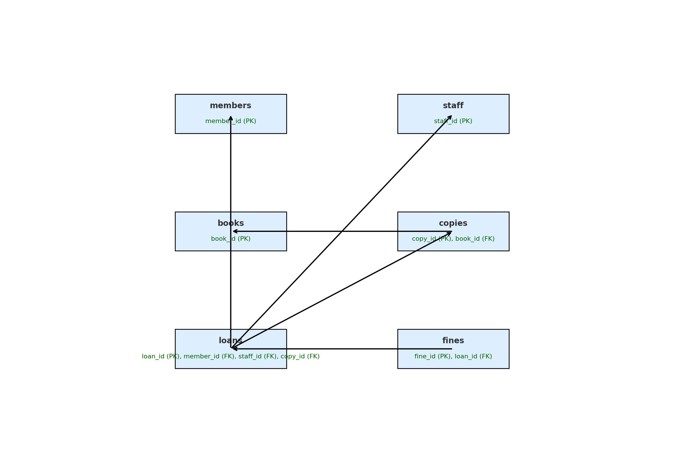

# 智慧圖書館借還書資料庫系統

SQL Server + Python/Tkinter 的圖書館管理系統，涵蓋會員、館員、書籍複本、借閱、預約、逾期罰款與查詢 GUI。

## 資料庫設計

- 3NF 關聯式 schema
- PK、FK、CHECK constraint
- 借閱／歸還狀態一致性
- 借書流程使用 transaction，錯誤時 rollback
- 會員卡號與館員角色檢查



## 建置

1. 在 SQL Server 執行 `database/schema.sql`。
2. 安裝 Microsoft ODBC Driver 17 或更新 `LIBRARY_DB_DRIVER`。
3. 設定環境變數並啟動 GUI。

```powershell
python -m venv .venv
pip install -r requirements.txt
$env:LIBRARY_DB_SERVER = "localhost\SQLEXPRESS"
$env:LIBRARY_DB_NAME = "SmartLibrary"
python src/staff_borrow_return_gui.py
```

選用環境變數：`LIBRARY_DB_DRIVER`、`LIBRARY_DB_TRUSTED_CONNECTION`。本機電腦名稱與帳密沒有寫入程式。

## 程式

- `staff_borrow_return_gui.py`：館員借還書 GUI
- `staff_borrow.py`：借書流程原型
- `member_query.py`：會員查詢
- `query_current_loans_gui.py`：目前借閱清單
- `db.py`：集中式環境設定連線
